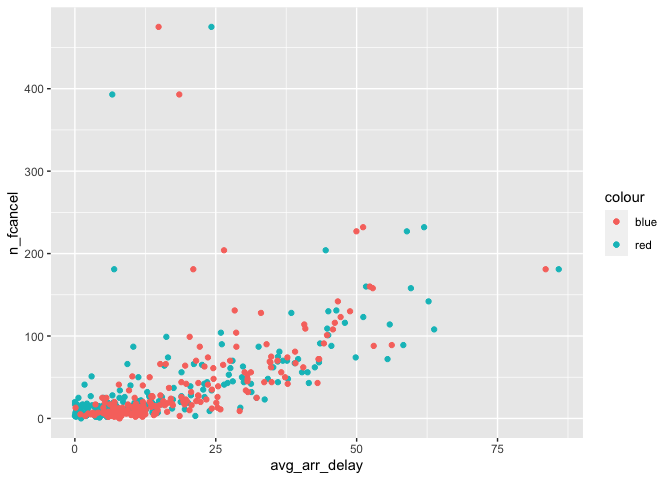

README
================
Chloe Chan

\#1: How many flights have a missing dep\_time? What other variables are
missing? What might these rows represent?

``` r
a <-filter(nycflights13 :: flights, is.na(nycflights13::flights$dep_time))
nrow(a)
```

    ## [1] 336776

\#1: There are 8255 flights that have a missing departure time. Other
variables that are missing from this data are the arrival times,
departure delay. These rows might represent the flights that were
cancelled or rescheduled.

\#2: Currently dep\_time and sched\_dep\_time are convenient to look at,
but hard to compute with because they’re not really continuous
numbers. Convert them to a more convenient representation of number of
minutes since midnight.

``` r
library(tidyverse)
```

    ## ── Attaching packages ─────────────────────────────────────── tidyverse 1.3.0 ──

    ## ✓ ggplot2 3.3.3     ✓ purrr   0.3.4
    ## ✓ tibble  3.0.4     ✓ dplyr   1.0.4
    ## ✓ tidyr   1.1.2     ✓ stringr 1.4.0
    ## ✓ readr   1.4.0     ✓ forcats 0.5.0

    ## ── Conflicts ────────────────────────────────────────── tidyverse_conflicts() ──
    ## x dplyr::filter() masks stats::filter()
    ## x dplyr::lag()    masks stats::lag()

``` r
flights <- nycflights13::flights
b <- transmute(flights,
    dep_time,
    dep_time_minutes = (dep_time %/% 100)*60 + (dep_time %% 100))
c <- transmute(flights,
    sched_dep_time,
    sched_dep_time_minutes = (sched_dep_time %/% 100)*60 + (sched_dep_time %% 100))
mutate(b, c)
```

    ## # A tibble: 336,776 x 4
    ##    dep_time dep_time_minutes sched_dep_time sched_dep_time_minutes
    ##       <int>            <dbl>          <int>                  <dbl>
    ##  1      517              317            515                    315
    ##  2      533              333            529                    329
    ##  3      542              342            540                    340
    ##  4      544              344            545                    345
    ##  5      554              354            600                    360
    ##  6      554              354            558                    358
    ##  7      555              355            600                    360
    ##  8      557              357            600                    360
    ##  9      557              357            600                    360
    ## 10      558              358            600                    360
    ## # … with 336,766 more rows

\#3: Look at the number of cancelled flights per day. Is there a
pattern? Is the proportion of cancelled flights related to the average
delay? Use multiple dyplr operations, all on one line, concluding with
\`ggplot(aes(x= ,y=)) + geom\_point()’

``` r
flights %>% group_by(year, month, day) %>% summarise(n_fcancel = sum(is.na(air_time) | air_time == 0),avg_arr_delay = mean(arr_delay, na.rm = TRUE), avg_dep_delay = mean(dep_delay, na.rm = TRUE) ) %>%
select(year, month, day, n_fcancel, avg_arr_delay, avg_dep_delay) %>%
filter(avg_arr_delay > 0) %>% ggplot()+ geom_point(aes(x = avg_arr_delay, y = n_fcancel, color = "red"))+ geom_point(aes(x = avg_dep_delay, y = n_fcancel,color =  "blue")) 
```

    ## `summarise()` has grouped output by 'year', 'month'. You can override using the `.groups` argument.

<!-- -->

The proportion of cancelled flights increases as the average delay time
increases.

Github Link: <https://github.com/cchan88/443_homework_2>
